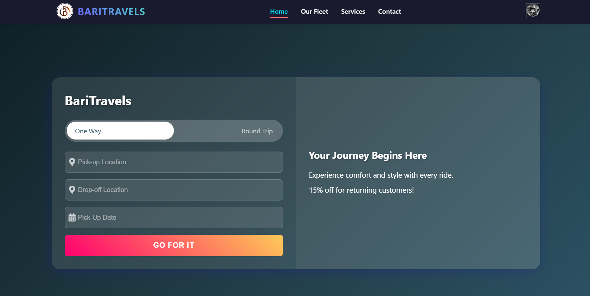
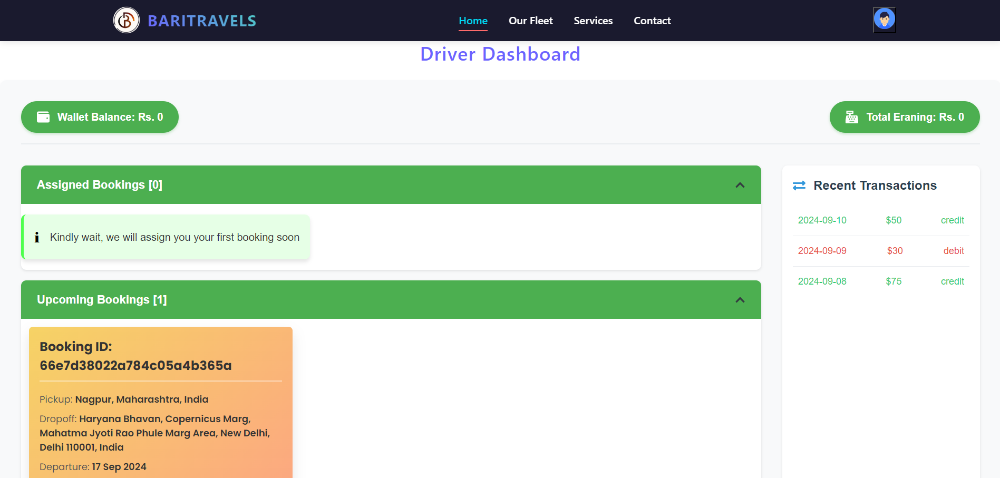
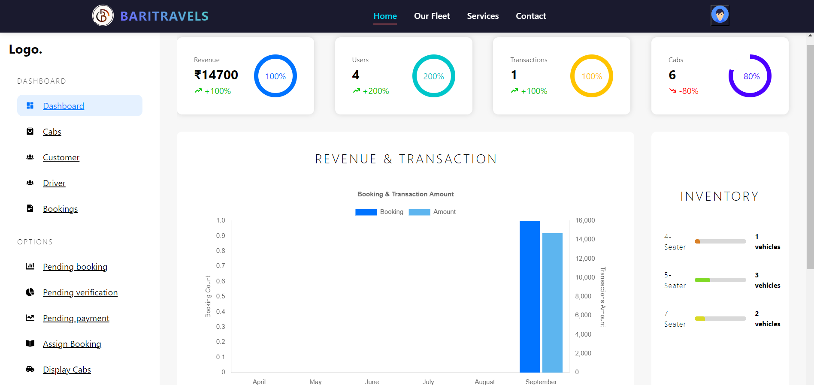

# 🚖 React JS Cab Management System

## 🏗️ Overview
This project is a **React JS** application designed for managing a cab service with three distinct roles: **Driver**, **Admin**, and **User**. It includes:
- 🗂️ Centralized logging.
- 📐 Scalable architecture.
- ⚡ Built with **Vite React** for blazing-fast performance using SWC.
- 🔍 Integrated **Husky**, **Commitlint**, and **ESLint** for clean, maintainable, and consistent frontend code.
- 💳 Payment integration with Razorpay.
- 📍 Advanced features like price calculation using Google Maps and Places APIs.

The project leverages modern React features and **Sass** for styling, ensuring a responsive and maintainable application. It is a **production-ready frontend** integrated with backend APIs.

---

## 🌟 Features

### 1. **Role-Based Functionality**
- 👩‍💼 **Admin**:
  - Manage users, drivers, and rides.
  - View detailed reports and logs.
- 🚘 **Driver**:
  - Accept or reject ride requests.
  - View earnings and payout history.
- 🙋 **User**:
  - Book rides with dynamic pricing.
  - View ride history and payment details.

### 2. **Centralized Logging**
- 📝 Logs all critical events, errors, and actions across the application.
- 🔍 Provides structured log messages for consistent formatting.
- 🔄 Easily extendable to integrate with external logging services.

### 3. **Payment and Payout Integration**
- 💳 **Razorpay Integration**:
  - Secure payment processing for ride bookings.
  - Automated payouts to drivers.

### 4. **Dynamic Price Calculation**
- 📍 Utilizes **Google Maps API** and **Places API** to calculate accurate trip distances and durations.
- ⚡ Real-time fare estimation based on distance, traffic, and other factors.

### 5. **Scalable Architecture**
- 🏗️ Designed for scalability and maintainability:
  - **Context API** for state management.
  - 🚀 **Lazy Loading** for components.
  - 🔄 **Custom Hooks** to encapsulate reusable logic.
  - 📦 **Code Splitting** for optimized performance.

### 6. **Modern Styling with Sass**
- 🎨 Modular stylesheets for better maintainability.
- 🧩 Variables, mixins, and nested rules for DRY (Don't Repeat Yourself) styling.
- 📱 Fully responsive design for all devices.

### 7. **Development Best Practices**
- ⚡ **Vite React** for faster builds and performance optimization with SWC.
- 🛡️ **Husky** to enforce pre-commit hooks.
- ✅ **Commitlint** for consistent and meaningful commit messages.
- 🛠️ **ESLint** to ensure clean and error-free code.

---

## 📂 Folder Structure

```
root-directory
├── public
│   ├── index.html          # Main HTML file
│   └── assets/             # Static assets (images, icons, etc.)
├── src
│   ├── components/         # Reusable React components
│   │   ├── Header.js
│   │   ├── Footer.js
│   │   └── ...
│   ├── pages/              # Page components
│   │   ├── Home.js
│   │   ├── AdminDashboard.js
│   │   ├── DriverDashboard.js
│   │   ├── UserDashboard.js
│   │   └── ...
│   ├── context/            # Context API setup
│   │   ├── AuthContext.js
│   │   ├── LogContext.js
│   │   └── ...
│   ├── hooks/              # Custom hooks
│   │   ├── useLogger.js
│   │   ├── usePayment.js
│   │   └── ...
│   ├── services/           # API or utility functions
│   │   ├── paymentService.js
│   │   ├── mapsService.js
│   │   └── ...
│   ├── styles/             # Global and modular styles (Sass)
│   │   ├── main.scss
│   │   └── ...
│   ├── App.js              # Root React component
│   ├── index.js            # Application entry point
│   └── ...
└── package.json
```

---

## 🚀 Getting Started

### 🛠️ Prerequisites
- 📦 Node.js and npm installed on your system.
- 🔑 Google Maps API key and Razorpay credentials.

### 🖥️ Installation
1. Clone the repository:
   ```bash
   git clone https://github.com/your-repository-name.git
   ```
2. Navigate to the project directory:
   ```bash
   cd your-repository-name
   ```
3. Install dependencies:
   ```bash
   npm install
   ```
4. Configure environment variables:
   - Create a `.env` file in the root directory.
   - Add the following variables:
     ```env
     VITE_SERVER = http://localhost:4000
     VITE_RAZORPAY_API = your-razorpay-api-key
     VITE_APP_GOOGLE_MAPS_KEY=your-google-maps-api-key
     ```

### ▶️ Running the Project
- Development Mode:
  ```bash
  npm run dev
  ```
  Open [http://localhost:5173](http://localhost:5173) to view it in the browser.

- Build for Production:
  ```bash
  npm run build
  ```

---

## 🧑‍💻 Usage
- **Admin**: Log in to manage the platform and view reports.
- **Drivers**: Log in to manage ride requests and view payouts.
- **Users**: Log in to book rides and view their ride history.
- Payment processing and fare calculation are handled seamlessly.

---

## 🔮 Future Enhancements
- 📡 Integrate driver tracking in real-time.
- 🌍 Add support for multi-language localization.
- 🔔 Implement notifications for ride updates.
- 🧪 Add unit and integration tests for key components.

---

## 📸 Visuals

### **Screenshots**
<div align="center">
  
  <p>User Booking Page</p>
  
  
  <p>Driver Dashboard</p>

  
  <p>Admin Dashboard</p>

</div>

---

## 🤝 Contributing
Contributions are welcome! Follow these steps:
1. Fork the repository.
2. Create a feature branch:
   ```bash
   git checkout -b feature-name
   ```
3. Commit changes:
   ```bash
   git commit -m "Description of changes"
   ```
4. Push to the branch:
   ```bash
   git push origin feature-name
   ```
5. Open a pull request.

---

## 📜 License
This project is licensed under the MIT License. See the `LICENSE` file for details.

---

## 🙏 Acknowledgments
- 📘 React Documentation
- 🎨 Sass Documentation
- 🗺️ Google Maps API Documentation
- 💳 Razorpay Documentation
- 💡 Inspiration from scalable React architecture guides.

---

Feel free to customize and improve the application further! 🌟

